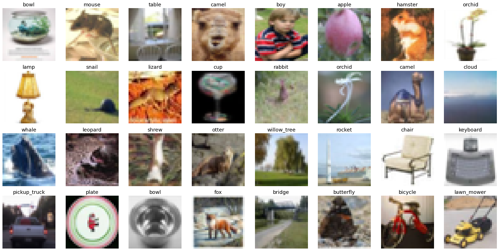
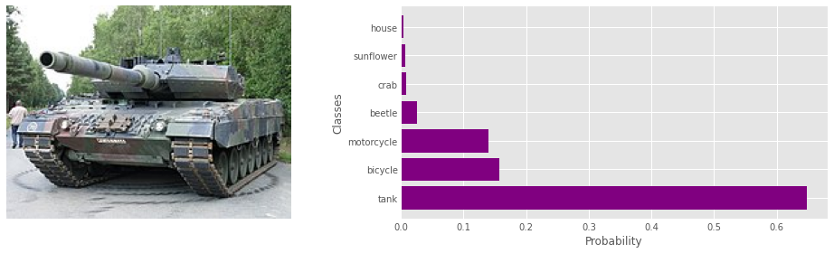
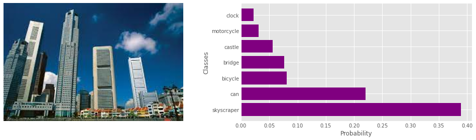
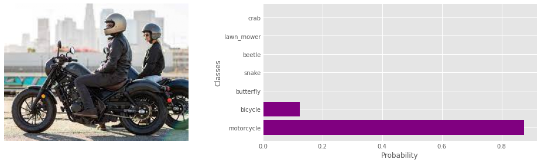
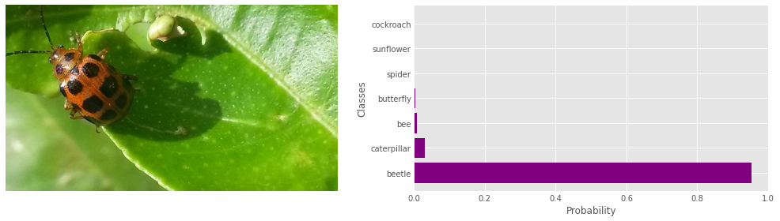
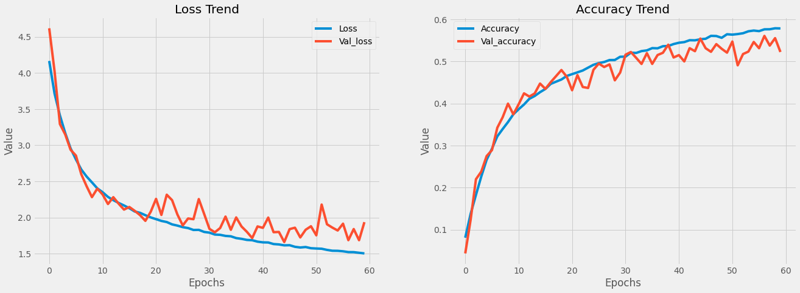

# CIFAR 100 Image Classification

In this notebook, I am going to classify images from the CIFAR-100 dataset. The dataset consists of airplanes, dogs, cats, and other objects. You'll preprocess the images, then train a convolutional neural network on all the samples. The dataset can downloaded by clicking [here](https://www.cs.toronto.edu/~kriz/cifar-100-python.tar.gz)

## The Dataset

This dataset is just like the CIFAR-10, except it has 100 classes containing 600 images each. There are 500 training images and 100 testing images per class. The 100 classes in the CIFAR-100 are grouped into 20 superclasses. Each image comes with a "fine" label (the class to which it belongs) and a "coarse" label (the superclass to which it belongs).
Here is the list of classes in the CIFAR-100:

| Superclass Classes | Classes |
| ---: | :--- |
| aquatic mammals | beaver, dolphin, otter, seal, whale |
| fish | aquarium fish, flatfish, ray, shark, trout |
| flowers | orchids, poppies, roses, sunflowers, tulips |
| food containers | bottles, bowls, cans, cups, plates |
| fruit and vegetables | apples, mushrooms, oranges, pears, sweet peppers |
| household electrical devices | clock, computer keyboard, lamp, telephone, television |
| household furniture | bed, chair, couch, table, wardrobe |
| insects | bee, beetle, butterfly, caterpillar, cockroach |
| large carnivores | bear, leopard, lion, tiger, wolf |
| large man-made outdoor things | bridge, castle, house, road, skyscraper |
| large natural outdoor scenes | cloud, forest, mountain, plain, sea |
| large omnivores and herbivores | camel, cattle, chimpanzee, elephant, kangaroo |
| medium-sized mammals | fox, porcupine, possum, raccoon, skunk |
| non-insect invertebrates | crab, lobster, snail, spider, worm |
| people | baby, boy, girl, man, woman |
| reptiles | crocodile, dinosaur, lizard, snake, turtle |
| small mammals | hamster, mouse, rabbit, shrew, squirrel |
| trees | maple, oak, palm, pine, willow |
| vehicles 1 | bicycle, bus, motorcycle, pickup truck, train |
| vehicles 2 | lawn-mower, rocket, streetcar, tank, tractor |

## Predictions

## Final Testing Results

    Model Accuracy: 57.920 %
    Model Loss: 1.6011

## Model Loss and Accuracy

## Dependencies

- Jupyter Notebook v6.4.8
- Python v3.9.7
- Tensorflow v2.9.1
- Keras v2.9.0
- Numpy v1.22.2
- Pandas v1.4.2
- Matplotlib v3.2.2